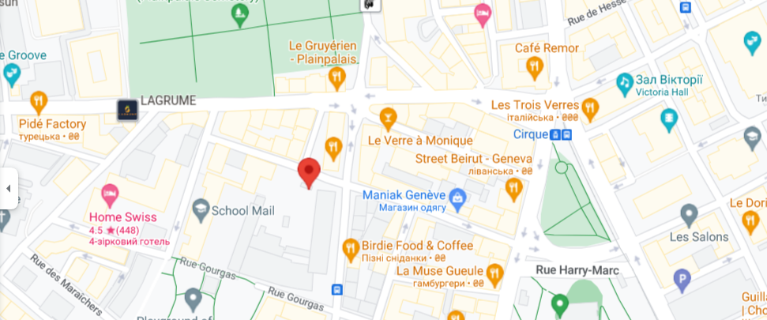

{: .logo}

# Alcohólicos Anónimos

## Qué es A.A.?

Alcohólicos Anónimos es una comunidad de personas que se unen para resolver su problema con la bebida. No cuesta nada asistir a las reuniones de A.A. No hay requisitos de edad o educación para participar. La membresía está abierta para cualquiera que desee hacer algo respecto a su problema con el alcohol.

El propósito principal de A.A. es ayudar a los alcohólicos a alcanzar la sobriedad.

## Reuniones de AA
{: #meeting}

📍 Geneva, Switzerland 🇨🇭 -- Viernes a las 19:30hs

<iframe src="https://www.google.com/maps/embed?pb=!1m18!1m12!1m3!1d2761.4940588937375!2d6.134616976442077!3d46.20062587109554!2m3!1f0!2f0!3f0!3m2!1i1024!2i768!4f13.1!3m3!1m2!1s0x478c64d456a621d5%3A0x2a019a284086221c!2sRue%20du%20Vieux-Billard%2023%2C%201205%20Gen%C3%A8ve!5e0!3m2!1ses!2sch!4v1696961195477!5m2!1ses!2sch" width="600" height="450" style="border:0;" allowfullscreen="" loading="lazy" referrerpolicy="no-referrer-when-downgrade"></iframe>

Rue du Vieux-Billard 23, Genève {: target='_blanc'}

Si necesita ayuda con un problema de alcohol, llame gratis a nuestra línea de ayuda nacional. Hay varias opciones dependiendo el idioma con el que se sienta cómodo.

## Contáctanos
{: #contacts}

Para más información, contactar a:

[AA Inglés Geneva](https://www.aageneva.org/)

☎️ +41-79-466-5330

[AA Inglés Zurich](https://aazurich.org/)

☎️ +41-32-511-6967

[AA Francés](http://www.aasri.ch/)

☎️ 0848-848-846

[AA Alemán](https://www.anonyme-alkoholiker.ch/)

☎️ 0848-848-885

[AA Español](#)

☎️ +41-78-239-7160
